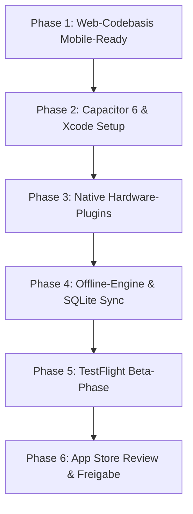

# 05: Release-Roadmap & Toolchain

Dieses Dokument definiert die technische Toolchain, die organisatorischen Voraussetzungen und den schrittweisen Phasenplan von der Webanwendung bis zum Live-Release im Apple App Store.

---

## 1. Voraussetzungen & Apple Accounts

| Anforderung | Status / Details | Zweck |
|:---|:---|:---|
| **Apple Developer Account** | Organisation (Firma) oder Einzelentwickler (99 USD/Jahr) | Berechtigung zur Veröffentlichung im weltweiten App Store. Für B2B-Firmen wird eine **D-U-N-S Nummer** benötigt. |
| **App Store Connect** | App-ID anlegen: `ch.kurka.taskster` (oder Wunsch-Bundle-ID) | Verwaltung von Metadaten, Screenshots, TestFlight und Release. |
| **APNs Authentication Key** | `.p8` Key mit Push-Berechtigung | Für Server-seitiges Senden von iOS Push-Benachrichtigungen. |
| **macOS Build-Rechner** | Mac mit Apple Silicon (M1/M2/M3/M4) + Xcode 15/16 | Kompilierung des nativen Swift-Codes und IPA-Signierung (lokal oder via GitHub Actions macOS-Runner). |

---

## 2. Technische Toolchain

- **Capacitor 6 CLI:** Synchronisiert Web-Assets in das native Xcode-Projekt.
- **Xcode & CocoaPods / Swift Package Manager:** Kompiliert das native iOS Binary (`.ipa`).
- **Fastlane (optional, empfohlen):** Automatisiert den Build-Upload zu Apple TestFlight mit einem einzigen Terminal-Befehl (`bundle exec fastlane beta`).

---

## 3. Schrittweiser Phasenplan zur Veröffentlichung

### Phase 1: Web-Codebasis Mobile-Ready (Dauer: ca. 3–5 Tage)
- [ ] Safe-Area-Insets im Tailwind-Layout einbinden (`safe-area-inset-top` / `bottom`).
- [ ] Responsive Bottom Navigation Bar für Smartphones integrieren.
- [ ] Zwingende Account-Löschung unter Profil/Einstellungen einbauen (Guideline 5.1.1(v)).
- [ ] Externe Stripe-/Kauf-Verlinkungen für Mobile-Target ausblenden (Guideline 3.1.3(a)).

### Phase 2: Capacitor 6 & Xcode Projekt (Dauer: ca. 1–2 Tage)
- [ ] Installation von `@capacitor/core`, `@capacitor/cli`, `@capacitor/ios`.
- [ ] Initialisierung: `npx cap init "Taskster" "ch.kurka.taskster"`.
- [ ] Nuxt 3 Build-Script für SPA-Generierung konfigurieren (`npm run build:mobile`).
- [ ] Natives iOS-Projekt erzeugen: `npx cap add ios`.
- [ ] App-Icon (1024x1024px) und Splash-Screens generieren.

### Phase 3: Native Hardware-Plugins (Dauer: ca. 3–4 Tage)
- [ ] `@capacitor/camera`: Direkter Kamera-Aufruf mit Komprimierung für Baustellenfotos.
- [ ] Native Audioaufnahme / Voice Recorder (.m4a AAC) mit Whisper-API-Anbindung.
- [ ] `@capgo/capacitor-native-biometric`: Face ID / Touch ID Login.
- [ ] `@capacitor/haptics`: Vibrations-Feedback bei Aktionen.
- [ ] `@capacitor/push-notifications`: APNs Registrierung & Token-Sync.
- [ ] `Info.plist` mit präzisen Berechtigungstexten und `PrivacyInfo.xcprivacy` befüllen.

### Phase 4: Offline-Engine & SQLite Cache (Meilenstein M6, ca. 5–7 Tage)
- [ ] Lokale SQLite Datenbank im iOS App-Storage aufsetzen (`@capacitor-community/sqlite`).
- [ ] Mutation Queue für Offline-Aktionen (Tasks anlegen, Zeiten buchen) implementieren.
- [ ] Reconnect-Sync-Worker bei Netzwerk-Wiederherstellung testen.

### Phase 5: TestFlight Beta-Phase (Dauer: ca. 1–2 Wochen)
- [ ] Ersten Build nach Apple TestFlight hochladen.
- [ ] Interne Verteilung an Martin und Test-Bauleiter über die TestFlight-App.
- [ ] Praxistest auf echten Baustellen (Kamera, Voice Memos, Offline-Modus, Akkuverbrauch).

### Phase 6: App Store Review & Go-Live (Dauer: ca. 3–5 Tage)
- [ ] App Store Screenshots für 6.7" (iPhone Pro Max) und 6.5" erstellen.
- [ ] App-Beschreibung, Keywords und Support-URL (z. B. `https://taskster.ch/support`) hinterlegen.
- [ ] Demo-Account für Apple Reviewer in den Einreichungsnotizen hinterlegen.
- [ ] Einreichung zur Prüfung (App Review dauert in der Regel 24–48 Stunden).
- [ ] **Erfolgreiche Freigabe im weltweiten App Store.**
