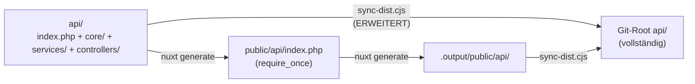

# Architektur-Entscheidungen (ADRs) – Extended Admin Panel

> **Status:** Verbindlich – Entschieden am 2026-09-26
> **Gilt für:** Alle 8 Funktionen in [99_plans/extended_admin_panel/](file:///c:/Users/marti/Taskster/99_plans/extended_admin_panel)

---

## ADR-001: `companies` erweitern statt `tenants`

**Entscheidung:** Die bestehende `companies`-Tabelle wird um Mandanten-Features erweitert. Keine neue `tenants`-Tabelle.

**Auswirkungen auf Pläne:**
- Alle Referenzen auf `tenant_id` → `company_id`
- Alle Referenzen auf `tenants`-Tabelle → `companies`-Tabelle
- `TenantController.php` → `CompanyController.php`

**Schema-Erweiterung:**
```sql
ALTER TABLE companies ADD COLUMN status VARCHAR(20) NOT NULL DEFAULT 'active';
-- Werte: active, suspended, read_only, archived
ALTER TABLE companies ADD COLUMN max_users INT NOT NULL DEFAULT 100;
ALTER TABLE companies ADD COLUMN max_storage_gb INT NOT NULL DEFAULT 10;
ALTER TABLE companies ADD COLUMN max_tasks_per_month INT NOT NULL DEFAULT 10000;
ALTER TABLE companies ADD COLUMN api_rate_limit_per_minute INT NOT NULL DEFAULT 60;
ALTER TABLE companies ADD COLUMN auth_policy JSON NULL;
-- Inhalt: password_min_length, mfa_policy, session_timeout, etc.
ALTER TABLE companies ADD COLUMN sso_config JSON NULL;
-- Inhalt: provider, entity_id, metadata_xml, client_id, role_mapping
```

**Bestehende Felder die bleiben:**
- `companies.settings` JSON → enthält bereits Feature-Flags
- `companies.subscription_plan` → Plan-Info
- `companies.billing_email` → bereits vorhanden

---

## ADR-002: JSON-in-Column beibehalten für Custom Fields

**Entscheidung:** Das bestehende Pattern (`tasks.custom_data` JSON + `folder_field_definitions`) wird beibehalten und erweitert. Kein Wechsel auf EAV.

**Auswirkungen auf Pläne:**
- Plan `02_workflow_engine.md`: `custom_fields` + `custom_field_values` Tabellen **entfallen**
- Stattdessen: `folder_field_definitions` erweitern

**Schema-Erweiterung `folder_field_definitions`:**
```sql
ALTER TABLE folder_field_definitions ADD COLUMN validation_rules JSON NULL;
-- Inhalt: {"required": true, "min_length": 3, "pattern": "^[A-Z]"}
ALTER TABLE folder_field_definitions ADD COLUMN visibility_conditions JSON NULL;
-- Inhalt: {"required_when_status": ["in_progress"], "required_per_project_type": {"type_a": true}}
ALTER TABLE folder_field_definitions ADD COLUMN is_system TINYINT(1) NOT NULL DEFAULT 0;
```

**Bestehende Felder die bleiben:**
- `folder_field_definitions.entity_type` (default `'task'`)
- `folder_field_definitions.logic_rules` JSON
- `folder_field_definitions.label_key` (i18n-Key)

**Neue Feldtypen (ergänzend zu bestehenden 9):**
- `user_reference` → Speichert User-ID in `custom_data`, Frontend löst auf
- `file_attachment` → Speichert File-UUID in `custom_data`, verlinkt mit `files`-Tabelle (Phase 7)

---

## ADR-003: `admin_permissions` in `roles` + `role_permissions` migrieren

**Entscheidung:** Das bestehende `users.admin_permissions` JSON-Array wird in ein relationales RBAC-System migriert.

**Neue Tabellen:**
```sql
CREATE TABLE roles (
    id BIGINT UNSIGNED AUTO_INCREMENT PRIMARY KEY,
    `key` VARCHAR(50) NOT NULL,
    name VARCHAR(100) NOT NULL,
    level ENUM('system', 'company', 'project') NOT NULL DEFAULT 'company',
    description TEXT NULL,
    is_system TINYINT(1) NOT NULL DEFAULT 0,
    sort_order INT NOT NULL DEFAULT 0,
    created_at TIMESTAMP DEFAULT CURRENT_TIMESTAMP,
    updated_at TIMESTAMP DEFAULT CURRENT_TIMESTAMP ON UPDATE CURRENT_TIMESTAMP,
    UNIQUE KEY uk_role_key (`key`)
);

CREATE TABLE permissions (
    id BIGINT UNSIGNED AUTO_INCREMENT PRIMARY KEY,
    `key` VARCHAR(100) NOT NULL,
    entity VARCHAR(30) NOT NULL,
    action VARCHAR(30) NOT NULL,
    description TEXT NULL,
    is_system TINYINT(1) NOT NULL DEFAULT 0,
    created_at TIMESTAMP DEFAULT CURRENT_TIMESTAMP,
    UNIQUE KEY uk_permission_key (`key`)
);

CREATE TABLE role_permissions (
    id BIGINT UNSIGNED AUTO_INCREMENT PRIMARY KEY,
    role_id BIGINT UNSIGNED NOT NULL,
    permission_id BIGINT UNSIGNED NOT NULL,
    scope ENUM('all', 'company', 'project', 'assigned') NOT NULL DEFAULT 'all',
    conditions JSON NULL,
    created_at TIMESTAMP DEFAULT CURRENT_TIMESTAMP,
    UNIQUE KEY uk_role_perm_scope (role_id, permission_id, scope),
    FOREIGN KEY (role_id) REFERENCES roles(id) ON DELETE CASCADE,
    FOREIGN KEY (permission_id) REFERENCES permissions(id) ON DELETE CASCADE
);

CREATE TABLE user_company_roles (
    id BIGINT UNSIGNED AUTO_INCREMENT PRIMARY KEY,
    user_id VARCHAR(64) NOT NULL,
    company_id VARCHAR(64) NOT NULL,
    project_id VARCHAR(64) NULL,
    role_id BIGINT UNSIGNED NOT NULL,
    assigned_by VARCHAR(64) NULL,
    expires_at TIMESTAMP NULL,
    created_at TIMESTAMP DEFAULT CURRENT_TIMESTAMP,
    UNIQUE KEY uk_user_company_role (user_id, company_id, project_id, role_id),
    FOREIGN KEY (role_id) REFERENCES roles(id) ON DELETE CASCADE
);
```

**Migrationspfad (bestehende Daten):**
```sql
-- Seed System-Rollen
INSERT INTO roles (`key`, name, level, is_system) VALUES
    ('superadmin',      'Superadmin',       'system',  1),
    ('company_admin',   'Firmen-Admin',     'company', 1),
    ('project_manager', 'Projekt-Manager',  'company', 1),
    ('member',          'Mitarbeiter',      'company', 1),
    ('viewer',          'Betrachter',       'company', 1);

-- Migration bestehender admin_permissions
-- users WHERE is_superadmin = 1 → user_company_roles mit role: superadmin
-- users WHERE company_role = 'admin' → user_company_roles mit role: company_admin
-- users WHERE admin_permissions LIKE '%manage_users%' → zusätzliche Permissions

-- Bestehende project_members.role bleibt unverändert (owner/admin/editor/viewer)
-- → Wird in Phase 1 als FK auf roles-Tabelle verlinkt
```

**Übergangsphase:**
- `users.admin_permissions` und `users.is_superadmin` bleiben vorerst bestehen
- `PermissionService.php` prüft **zuerst** neues System, dann Fallback auf Legacy
- Feature-Flag: `FEATURE_RBAC_V2` steuert Umschaltung
- Nach Verifikation: Legacy-Spalten entfernen

---

## ADR-004: Design v2 als Default, v1 wird abgelöst

**Entscheidung:** Die Werte aus [design-v2-tokens.json](file:///c:/Users/marti/Taskster/99_anweisungen/design-v2-tokens.json) werden als System-Defaults in die `design_tokens`-Tabelle geseedet. v1-Tokens werden nicht geseedet.

**Konsequenzen:**
- Primärfarbe wechselt von `#00A3C4` (v1) → `#0891B2` (v2)
- Liquid-Glass-Effekte werden standardmäßig deaktiviert (v2: `"removed": true`)
- Basis-Schriftgröße wechselt von 12px → 14px
- Border-Radii werden vereinfacht (6 → 3 Stufen)
- Shadows werden vereinfacht (6 → 2 Stufen)

> [!WARNING]
> **Achtung:** Dies ist ein visueller Breaking Change. Alle bestehenden CSS-Referenzen auf v1-Tokens müssen aktualisiert werden. Empfehlung: Via Feature-Flag `FEATURE_DESIGN_V2` schrittweise aktivieren.

**Schema `design_tokens`:**
```sql
CREATE TABLE design_tokens (
    id BIGINT UNSIGNED AUTO_INCREMENT PRIMARY KEY,
    `key` VARCHAR(100) NOT NULL,
    value TEXT NOT NULL,
    category VARCHAR(50) NOT NULL,
    subcategory VARCHAR(50) NULL,
    mode ENUM('light', 'dark', 'high_contrast', 'all') NOT NULL DEFAULT 'all',
    description TEXT NULL,
    company_id VARCHAR(64) NULL,
    is_system TINYINT(1) NOT NULL DEFAULT 0,
    created_at TIMESTAMP DEFAULT CURRENT_TIMESTAMP,
    updated_at TIMESTAMP DEFAULT CURRENT_TIMESTAMP ON UPDATE CURRENT_TIMESTAMP,
    UNIQUE KEY uk_token_key_company_mode (`key`, company_id, mode)
);
```

---

## ADR-005: Saubere Trennung `api/` Source + `sync-dist.cjs` erweitern

**Entscheidung:** PHP-Source bleibt unter `api/`, `sync-dist.cjs` wird erweitert um die modulare Struktur mitzukopieren.

**Deployment-Flow:**


**Änderungen an `sync-dist.cjs`:**
```js
// NEU: api/ Verzeichnis vollständig kopieren (nicht nur aus .output)
copyRecursiveSync(
    path.join(projectRoot, 'api'),       // Source
    path.join(projectRoot, 'api')        // Dest (identisch = nichts zu tun)
);
// api/ liegt bereits im Git-Root → wird direkt committed
// .output/public/api/index.php wird NICHT mehr nach Root kopiert
// (stattdessen: public/api/index.php = require_once '../api/index.php')
```

**`public/api/index.php` wird zu:**
```php
<?php
// Redirect to main API entrypoint
require_once __DIR__ . '/../../api/index.php';
```

**`server-php/` wird gelöscht:**
```bash
git rm -rf server-php/
```

---

## Zusammenfassung: Auswirkungen auf die 8 Pläne

| Plan | Betroffene ADRs | Hauptänderung |
|------|-----------------|--------------|
| 01 Design Tokens | ADR-004, ADR-001 | v2 als Default, `company_id` statt `tenant_id` |
| 02 Workflow Engine | **ADR-002**, ADR-001, ADR-003 | **Kein EAV**, `folder_field_definitions` erweitern, Transitions nutzen `roles` |
| 03 I18n/CMS | ADR-001 | `company_id` statt `tenant_id` |
| 04 RBAC/Tenants | **ADR-001**, **ADR-003** | **Keine `tenants`-Tabelle**, `companies` erweitern, `admin_permissions` migrieren |
| 05 Time/Finance | ADR-001 | `company_id` statt `tenant_id` |
| 06 Notifications | ADR-001 | `company_id` statt `tenant_id`, bestehende `email_outbox` erweitern |
| 07 AI Orchestration | ADR-001 | `company_id` statt `tenant_id` |
| 08 Storage | ADR-001, ADR-005 | `company_id` statt `tenant_id`, Deployment-Pfad beachten |
